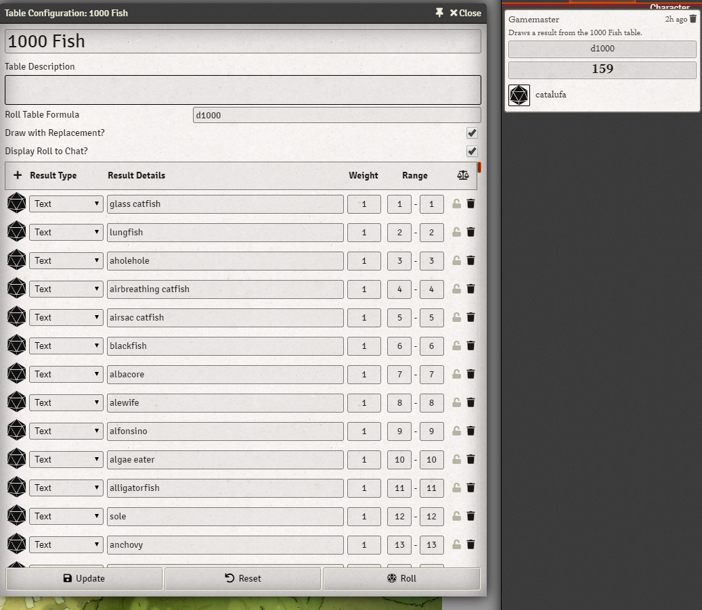

# 1000 Fish

A rollable table of 1000 fish, created by burkenhare #4761 (Discord) 

"Typical use:
PC wants to roll for a survival check, after the party makes camp alongside a river. The GM makes them roll on the d1000 fish table to determine what kind of fish they catch (thank god there is such a thing, or else it would be trout every time!) .  They roll a 210, why, it's a cownose ray! But every adventurer knows that the cownose ray is a saltwater animal, that could only mean one thing.... FLOOD!
So you see, it can be used in many ways to contribute to the plot." - Burkenhare

## Changelog

